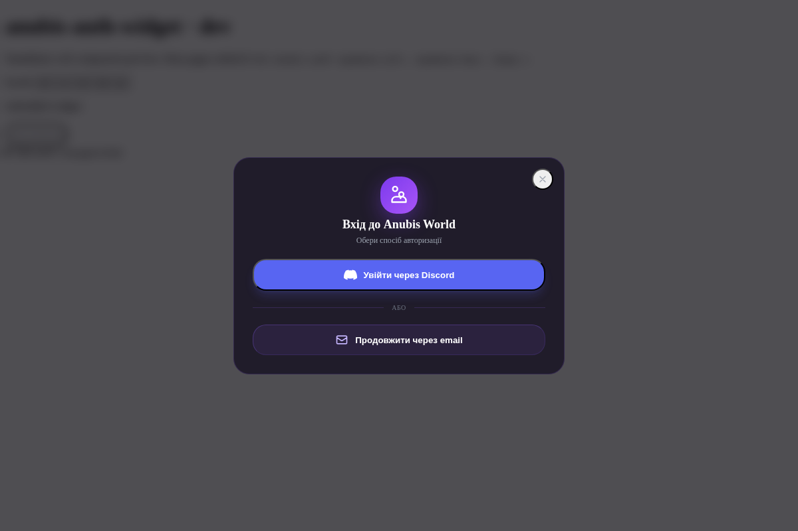

# anubis-auth-widget

Embeddable login widget для сайту й лаунчера Anubis World. Один Web Component, один бандл — спільний UI для статичного сайту і Electron-лаунчера.



## Що робить

Email + пароль або Discord OAuth (через Supabase). Після логіну — pill з Minecraft-ніком і кнопкою logout. Новим юзерам без ніка показує форму його встановлення.

Нік — той самий ідентифікатор, що йде в гру. Один акаунт, один нік скрізь.

## Використання

```html
<script type="module" src="https://damanoreshkan-beep.github.io/anubis-auth-widget/anubis-auth.js"></script>

<anubis-auth
    supabase-url="<your-project>.supabase.co"
    supabase-key="<your-publishable-key>"
    lang="uk">
</anubis-auth>
```

Слухач стану:

```js
document.addEventListener('auth-changed', (e) => {
    const { user, nick } = e.detail
})
```

Локалі: `en`, `ru`, `uk`, `de`, `pl`.

## Стек

- Preact 10 + `preact-custom-element` — реєстрація `<anubis-auth>`
- `@supabase/auth-ui-react` через `preact/compat` alias
- Tailwind з `important: '.aw-scope'` + `preflight: false` — утиліти не ламають хост
- Vite library build → один ES-модуль з inline CSS

## Develop

```bash
npm install
npm run dev      # http://localhost:5173
npm run build    # → dist/anubis-auth.js
```

Конфіг Supabase для dev — `.env`:

```
VITE_SUPABASE_URL=...
VITE_SUPABASE_KEY=...
```

Деплой: push у `main` → GitHub Pages.

## License

MIT
